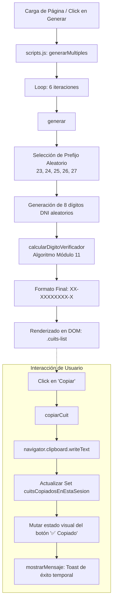

# 🧾 Generador de CUIT para Testing & Desarrollo

[](https://federicoiseas.github.io/CUITGenerator/)
[](https://developer.mozilla.org/es/docs/Web/JavaScript)
[](https://developer.mozilla.org/es/docs/Web/HTML)
[](https://developer.mozilla.org/es/docs/Web/CSS)
[](https://github.com/federicoiseas)

> **Herramienta web ligera, rápida y 100% client-side para generar identificadores fiscales argentinos (CUIT) matemáticamente válidos, pensada para desarrolladores, testers y analistas de QA.**

---

## 📌 Tabla de Contenidos

- [🎯 Propósito y Contexto](#-propósito-y-contexto)
- [✨ Características Principales](#-características-principales)
- [🏛️ Arquitectura del Sistema](#️-arquitectura-del-sistema)
  - [Diagrama de Flujo y Componentes](#diagrama-de-flujo-y-componentes)
  - [Capas del Proyecto](#capas-del-proyecto)
- [🧮 Lógica y Algoritmo Matemático (Módulo 11)](#-lógica-y-algoritmo-matemático-módulo-11)
  - [Estructura del CUIT](#estructura-del-cuit)
  - [Algoritmo de Validación](#algoritmo-de-validación)
- [📂 Estructura del Repositorio](#-estructura-del-repositorio)
- [🚀 Ejecución y Uso Local](#-ejecución-y-uso-local)
- [🧪 Casos de Uso](#-casos-de-uso)
- [🛡️ Seguridad y Privacidad](#️-seguridad-y-privacidad)
- [📚 Referencias Oficiales](#-referencias-oficiales)
- [👤 Autor y Contacto](#-autor-y-contacto)

---

## 🎯 Propósito y Contexto

Durante el desarrollo e integración de plataformas que interactúan con servicios fiscales argentinos (como **ARCA / AFIP**, sistemas de facturación electrónica, ERPs, CRMs o pasarelas de pago), es mandatorio validar formatos de CUIT sin utilizar información real ni sensible de personas o empresas (evitando problemas de privacidad o compliance con normativas de protección de datos).

Este proyecto ofrece una solución inmediata: genera lotes de CUITs ficticios pero con algoritmos de checksum 100% compatibles con las reglas de validación oficiales argentinas.

---

## ✨ Características Principales

- **⚡ Generación en Lotes (6 CUITs a la vez):** Provee una lista de identificadores listos para usar en pruebas de múltiples registros.
- **📋 Copia al Portapapeles con 1 Clic:** Integración nativa con la API de Portapapeles (`navigator.clipboard`) para agilizar el flujo de trabajo de testing.
- **🎯 Estado de Sesión Reactivo:** Rastreo en memoria mediante `Set` para indicar visualmente qué CUITs ya fueron copiados durante la sesión actual.
- **🌙 Diseño Dark Slate Moderno y Responsivo:** Layout adaptativo (CSS Grid & Flexbox) con soporte para dispositivos móviles, tablets y escritorio.
- **🧩 Zero Dependencies (Vanilla Stack):** Sin Node.js en runtime, sin frameworks pesados, sin librerías externas ni transpiladores.
- **🔒 100% Seguro y Privado:** Todo el procesamiento ocurre en el navegador del cliente; no se transmiten datos a ningún servidor externo.
- **📖 Módulo Educativo Integrado:** Explicación técnica de la composición del CUIT y enlace directo a la documentación oficial de ARCA.

---

## 🏛️ Arquitectura del Sistema

La aplicación fue construida bajo una **arquitectura cliente pura (Single Page Application estática)**, desacoplada en tres capas fundamentales: estructura semántica, diseño visual reactivo y motor de cálculo algorítmico.

### Diagrama de Flujo y Componentes



### Capas del Proyecto

1. **Capa de Presentación Semántica (`index.html`):**
   - Estructura HTML5 limpia con encabezados jerárquicos, contenedores principales (`<main>`, `<section>`, `<footer>`), accesibilidad con atributos `aria-label` y metaetiquetas OpenGraph para compartir en redes.
2. **Capa de Estilos y Diseño (`styles.css`):**
   - Paleta de colores personalizada tipo dark mode (`#192229`, `#252526`, `#2A3B47`, `#52A5E0`).
   - Sistema de grilla adaptable (`grid-template-columns: 1fr 1fr` en desktop y `1fr` en mobile).
   - Animaciones y transiciones CSS para feedback (`@keyframes slideIn`, hover effects).
3. **Capa de Lógica de Negocio y Eventos (`scripts.js`):**
   - Motor de números pseudoaleatorios y cálculo del dígito verificador.
   - Manejo reactivo de eventos (`load`, `click`), manipulación del DOM y consumo de la Clipboard API con manejo de errores asíncronos (`Promise`).

---

## 🧮 Lógica y Algoritmo Matemático (Módulo 11)

El **CUIT (Código Único de Identificación Tributaria)** consta de **11 dígitos** con el formato canónico `XX-XXXXXXXX-X`.

### Estructura del CUIT

| Segmento | Longitud | Significado / Contenido | Valores en la App |
|---|---|---|---|
| **Prefijo** | 2 dígitos | Tipo de persona / entidad | `23`, `24`, `25`, `26`, `27` (genéricos) |
| **Identificación** | 8 dígitos | Número de DNI o sociedad | 8 dígitos numéricos aleatorios |
| **Verificador** | 1 dígito | Checksum de integridad | Calculado mediante Módulo 11 |

### Algoritmo de Validación

Para calcular el dígito verificador a partir de los 10 primeros dígitos:

1. Se multiplican los primeros 10 dígitos por una serie fija de coeficientes ponderadores:
   $$\text{Ponderadores} = [5, 4, 3, 2, 7, 6, 5, 4, 3, 2]$$
2. Se calcula la sumatoria de los productos:
   $$\text{Suma} = \sum_{i=0}^{9} (\text{dígito}[i] \times \text{ponderador}[i])$$
3. Se obtiene el residuo mediante la operación módulo 11:
   $$\text{Resto} = \text{Suma} \pmod{11}$$
4. Se calcula el verificador inicial:
   $$\text{Verificador} = 11 - \text{Resto}$$
5. **Reglas de descarte y casos especiales:**
   - Si $\text{Verificador} = 11 \rightarrow 0$
   - Si $\text{Verificador} = 10 \rightarrow 9$
   - En cualquier otro caso $\rightarrow \text{Verificador}$

```javascript
function calcularDigitoVerificador(cuitSinVerificador) {
    const multiplicadores = [5, 4, 3, 2, 7, 6, 5, 4, 3, 2];
    let suma = 0;

    for (let i = 0; i < 10; i++) {
        suma += parseInt(cuitSinVerificador[i]) * multiplicadores[i];
    }

    const resto = suma % 11;
    const verificador = 11 - resto;

    if (verificador === 11) return 0;
    if (verificador === 10) return 9;
    return verificador;
}
```

---

## 📂 Estructura del Repositorio

```text
CUITGenerator/
├── index.html      # Estructura semántica, accesibilidad y maquetado principal
├── scripts.js      # Algoritmo Módulo 11, generación de datos y control de UI
├── styles.css      # Sistema de diseño, CSS Grid, dark mode y animaciones
├── img/
│   └── og-img.png  # Asset gráfico para vistas previas Open Graph (redes sociales)
└── README.md       # Documentación técnica y de arquitectura del proyecto
```

---

## 🚀 Ejecución y Uso Local

Al no requerir compilación ni instalación de dependencias, puede ejecutarse instantáneamente de dos formas:

### Opción 1: Abrir directamente en el navegador
```bash
# 1. Clonar el repositorio
git clone https://github.com/federicoiseas/CUITGenerator.git

# 2. Ingresar a la carpeta
cd CUITGenerator

# 3. Abrir index.html en tu navegador preferido
# (Doble clic en index.html o mediante tu navegador)
```

### Opción 2: Usar un servidor local estático (Opcional)
```bash
# Con extensión Live Server de VSCode o con npx:
npx serve .
```

---

## 🧪 Casos de Uso

- **Pruebas de Integración con Facturación Electrónica:** Validación de payloads JSON/XML hacia web services fiscales.
- **QA y Automatización (Cypress, Playwright, Selenium):** Carga masiva de datos en formularios con validaciones regex y algorítmicas de CUIT.
- **Fixtures y Seeds para Bases de Datos:** Población de esquemas de clientes/proveedores en entornos locales y staging.
- **Pruebas de UI/UX:** Verificación de máscaras de entrada de texto (`XX-XXXXXXXX-X`) y estados de error.

---

## 🛡️ Seguridad y Privacidad

> [!NOTE]
> **Aviso de Uso:** Los CUITs generados por esta aplicación son **matemáticamente válidos** (cumplen con el algoritmo de control de integridad de ARCA/AFIP), pero son **completamente ficticios**.
> 
> No representan ni están vinculados intencionalmente a identidades reales de personas humanas ni jurídicas. Esta herramienta debe ser utilizada **exclusivamente para fines de desarrollo, testing y pruebas de software**.

---

## 📚 Referencias Oficiales

- [ARCA (ex AFIP) – CUIT: Conceptos Básicos y Consultas](https://servicioscf.afip.gob.ar/publico/abc/ABCpaso2.aspx?cat=3040)
- [MDN Web Docs – Clipboard API](https://developer.mozilla.org/es/docs/Web/API/Clipboard_API)

---

## 👤 Autor y Contacto

Desarrollado con dedicación por **Federico Iseas**.

[](https://www.linkedin.com/in/federico-iseas)
[](https://github.com/federicoiseas)
[](mailto:federicoiseas@gmail.com)

---
*Generador de CUIT para Testing © 2026*
